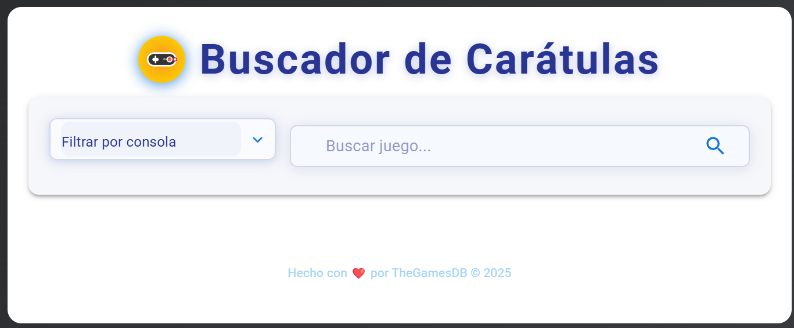
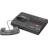
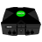
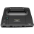
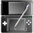
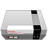
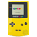
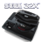
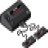

# 🎮 Buscador de Carátulas Retro

Aplicación web moderna y profesional para buscar videojuegos retro y mostrar sus carátulas y detalles completos, utilizando la API oficial de TheGamesDB.


[](https://thegamesdb.net/)   

---

## 🏁 Cómo iniciar el proyecto

Para evitar olvidos, aquí tienes los pasos rápidos para arrancar la aplicación en modo desarrollo:

1. Instala las dependencias si aún no lo has hecho:
  
   ```bash
   npm install
   ```

2. Inicia el servidor de desarrollo:

   ```bash
   npm run dev
   ```

3. Abre tu navegador en [http://localhost:5173](http://localhost:5173)

Recuerda: cada vez que quieras trabajar en el proyecto, ejecuta `npm run dev` desde la carpeta raíz.

---

## ✨ Características principales

- **Búsqueda rápida** de videojuegos retro por nombre y plataforma.
- **Visualización de carátulas** en alta calidad.
- Modal con ficha detallada: plataforma, región, fecha de lanzamiento, jugadores, co-op, desarrollador, géneros y descripción.
- **Botón para copiar todos los datos** del juego al portapapeles.
- **Descarga directa de la carátula**.
- **Enlace a la ficha oficial** en TheGamesDB.
- Interfaz responsive y moderna con Material UI, animaciones y efecto glass.
- Selector de plataformas filtrado solo por consolas retro, ordenadas alfabéticamente y con iconos personalizados.

---

## 📸 Vista del buscador



---

## 📸 Captura de pantalla


<!-- Puedes añadir más capturas aquí -->

---

## 🚀 Instalación y uso rápido

1. **Clona el repositorio:**
   ```bash
   git clone https://github.com/scorpio21/buscador_caratulas.git
   cd buscador_caratulas
   ```
2. **Copia el archivo de variables de entorno:**
   ```bash
   cp .env.example .env
   ```
3. **Consigue tu clave pública de TheGamesDB:**
   - Regístrate en [TheGamesDB](https://thegamesdb.net/) y obtén tu API Key pública.
   - Pega tu clave en el archivo `.env`:
     ```bash
     VITE_THEGAMESDB_API_KEY=tu_clave_publica
     ```
4. **Instala dependencias:**
   ```bash
   npm install
   ```
5. **Inicia el servidor de desarrollo:**
   ```bash
   npm run dev
   ```
   La app estará disponible en `http://localhost:5173` (o el puerto que indique tu entorno y que muestre la consola de Vite).

---

## 🛡️ Seguridad y buenas prácticas

- El archivo `.env` **no debe subirse nunca a GitHub**. Usa `.env.example` para compartir el formato.
- Solo utiliza la clave pública en el frontend.
- Si quieres máxima seguridad, implementa un backend proxy para ocultar la clave real.

---

## 🕹️ Tecnologías utilizadas

- **React** + **Vite** (frontend ultrarrápido)
- **Material UI** (diseño profesional y responsive)
- **Axios** (peticiones HTTP)
- **TheGamesDB API** (fuente de datos principal)

---

## 📦 Estructura del proyecto

```text
├── public/
│   ├── logo.svg              # Logo retro personalizado
│   ├── no-cover.png          # Imagen por defecto
│   └── platforms/            # Iconos PNG/SVG de consolas retro
├── src/
│   ├── components/           # Componentes React (GameList, PlatformComboBox, Footer)
│   ├── services/             # Lógica de acceso a la API
│   ├── App.tsx, App.css      # App principal y estilos
│   └── ...
├── .env.example              # Formato de variables de entorno
├── .gitignore
├── README.md
└── package.json
```

---

## 🎮 Plataformas disponibles en el selector

| Icono | Nombre | ID |
|---|---|---|
|  | PlayStation 1 | 10 |
|  | PlayStation 2 | 11 |
|  | PlayStation 3 | 12 |
|  | PlayStation 4 | 4919 |
|  | PlayStation 5 | 4980 |
|  | PlayStation Portable | 13 |
|  | PlayStation Vita | 39 |
|  | Amiga | 4911 |
|  | Amiga CD32 | 4947 |
|  | Xbox | 14 |
|  | Xbox 360 | 15 |
|  | Neo Geo | 24 |
|  | Nintendo DS | 8 |
|  | Nintendo NES | 7 |
|  | Game Boy Color | 41 |
|  | Nintendo Wii | 9 |
|  | Nintendo Wii U | 38 |
|  | Sega 32X | 33 |
|  | Sega CD | 21 |
|  | Sega Dreamcast | 16 |
|  | Sega Genesis | 18 |
|  | Sega Master System | 35 |
|  | Sega Mega Drive | 36 |

_Cada plataforma mostrada en el selector corresponde a un ID único de TheGamesDB y a un icono personalizado ubicado en `/public/platforms/`. Puedes ampliar la lista añadiendo nuevos iconos y asociando su ID en `PlatformComboBox.tsx`. El ID es el valor que usa la API para filtrar los juegos por consola._

### 🛠️ ¿Cómo añadir una nueva plataforma?

1. **Agrega el icono** (PNG o SVG) en la carpeta <code>/public/platforms/</code>.
   - Ejemplo: <code>nintendo-gamecube.png</code>
2. **Busca el ID de la plataforma** en TheGamesDB (por ejemplo, para GameCube es <code>23</code>).
   - Consulta la lista de IDs de plataformas en [TheGamesDB Platforms](https://thegamesdb.net/platforms).
3. **Edita <code>PlatformComboBox.tsx</code>** y añade la entrada en <code>CUSTOM_PLATFORM_ICONS</code>:
   ```typescript
   23: '/platforms/nintendo-gamecube.png', // Nintendo GameCube
   ```
4. **(Opcional)** Añade el ID al array <code>RETRO_PLATFORM_IDS</code> si quieres que aparezca en el selector:
   ```typescript
   const RETRO_PLATFORM_IDS = [
     ...,
     23, // Nintendo GameCube
   ];
   ```
5. **Guarda y reinicia el servidor de desarrollo**. ¡La nueva consola aparecerá en el selector con su icono!


---

## 💡 Notas y personalización

- Solo se muestran plataformas retro, ordenadas y con iconos personalizados (añade tus PNG/SVG en `/public/platforms`).
- El mensaje “No hay juegos con estos filtros.” solo aparece tras realizar una búsqueda sin resultados.
- Puedes ampliar la app para buscar por género, desarrollador, año, etc.
- El diseño es totalmente responsive, con animaciones y efecto glass.

---

## ❓ FAQ

### ¿Por qué algunos juegos no muestran todos los datos?
La API pública de TheGamesDB a veces no expone todos los campos que sí aparecen en la web. Siempre puedes consultar la ficha oficial con el enlace del modal.

### ¿Cómo añado más consolas retro o iconos?
- Añade el PNG/SVG a `/public/platforms/` y mapea el ID en `PlatformComboBox.tsx`.
- Puedes ampliar el array de IDs retro en ese mismo archivo.

### ¿Cómo contribuyo?
Haz un fork, crea una rama, haz tus cambios y abre un Pull Request. ¡Toda ayuda es bienvenida!

---

## 🤝 Contribución

1. Haz un fork del repositorio.
2. Crea una rama con tu funcionalidad: `git checkout -b mi-nueva-funcionalidad`
3. Haz commit de tus cambios: `git commit -am 'Añade nueva funcionalidad'`
4. Haz push a la rama: `git push origin mi-nueva-funcionalidad`
5. Abre un Pull Request.

---

## 📄 Licencia

Licencia MIT. Puedes usar, modificar y compartir libremente.

---

## 🙏 Créditos y agradecimientos

- Los datos y carátulas de videojuegos son proporcionados por [TheGamesDB.net](https://thegamesdb.net/).
- Esta app no está afiliada oficialmente a TheGamesDB, pero agradece enormemente su labor y API pública.

---

> Desarrollado con ❤️ por [scorpio21](https://github.com/scorpio21)
